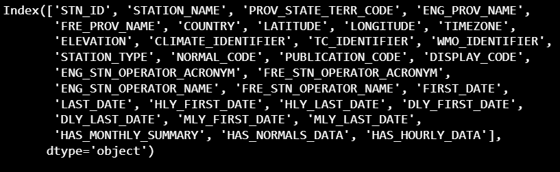

# Vancouver-or-raincouver?
Well, Well, Well! Vancouver has officially transformed to Raincouver. As of September 18th, the weather has started going overcast, damper and colder. Are we all in for the rainy drainy vancouver weather??

Do I despise the rainy Vancouver weather? or do I like the rainy Vancouver weather? 

I am kind of midway there, sometimes I like, sometimes I don't, a bit moody it seems. 
Nevertheless, I am building some data engineering skills. Data Engineering Yeah!!

## Data Engineering

One of the core skillsets sought in a data engineer is that they must be able to **design**, **build** and **maintain** automated **Extract, Transform & Load** data pipelines. 

Now, for all those sliding down into this rabbit hole for the first time, **ETL** pipelines are exactly what their name suggests: 

1. Extact data from a source location.
2. Make useful transformations / Apply business logic to the data.
3. Store the transformed data into a target location.

## Problem and Data Engineering

How is rainy, drainy Vancouver related to the data engineering heps. Well weather is weather, right? But, well weather is seasonal, has clear patterns and there is a lot to gain from understanding weather patterns. Even in my own case, I want to know roughly when the vancouver rain starts consistently, and when it stops. For that I can look at the weather pattern in the last ten years and make some claims by taking the mean of the onset of the rain in the last ten years.

## Objective

The goal is to analyse and visualize past ten years of Vancouver Weather Data.

## Method Flow

Since I am learning new tools, I have decided to implement the same ETL pipeline using different tools:

1. I want to do something completely local. Use python packages to extract, pyspark to transform and just dump the transformed data back to my local storage. I will create a DAG file and use Airflow to orchestrate the process.

2. I want to do the same pipeline completely on Azure. Use Azure Datafactory to build the pipeline, Azure Databricks to transform and store the data in Azure Data Lake Storage. I will also explore the use of Azure Synapse Analytics and as a bonus create vizualisations on PowerBI

3. I will repeat the above using Snowflake. I am not well versed with the subtools in snowflake to work this out, but I will explore and get it done.

## Data Source

The data source is the weather API from Government of Canada. The documentation is available [here](https://api.weather.gc.ca/). The climatic data at each station is recorded hourly, every hour every day [This statement in their website is false, the latest for running weather stations is Sept 21st 12:30PM, at current time Sept 23rd, 19:00 PM]. We will be using this API as the data source in this project. There are two particular pieces of information that we are interested in:

1. Climate Stations in Vancouver: There are **8552** weather stations in Canada of which **1752** weather stations are in British Columbia. Metro Vancouver's bounding box is [-123.264,49.002,-122.313,49.494], and the number of weather stations lying in this box is **246**. Woosh, only 246 weather stations to worry about. The below figure depicts the features of metro vancouver weather stations. Feature names are well named and self-explanatory. 

The 246 weather station also include legacy ones, which are not operational. We take advantage of the LAST_DATE feature and remove all the features which closed before 2020. There are 20 weather stations which satisy the above criteria, and 11 of them record climate daily whereas 9 of them record it hourly. The climate stations are located as follows:

2. Recorded climate observations in the above climate stations.

